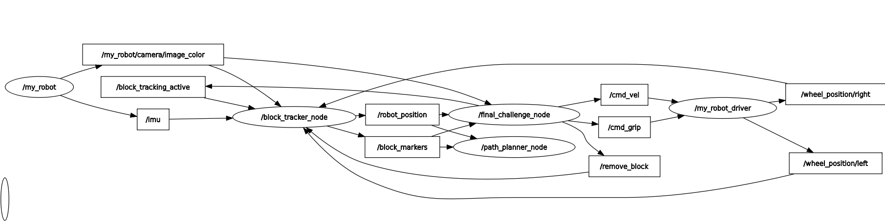

# enpm701_simulation
The objective of this personal project is to make a ros2 python package for a Webots simulation recreating the "final challenge" for course ENPM701 Autonomous Robots.
## Final Challenge
This challenge involved building a physical robot controlled by a raspberry pi and programming it to autonomously retrieve 9 blocks in order of color: red, green, blue, repeat. The robot begins in the 2 ft x 2 ft "landing zone" and must deliver all blocks to the 4 ft x 4 ft "construction zone" without knocking over any of the blocks. 
## Dependencies
| Category | Dependency |
|---|---|
| ROS2 Distribution | Humble |
| Simulation | `webots_ros2_driver`, `rclpy` |
| Computer Vision | `opencv-python` (`cv2`), `cv_bridge` |
| Navigation | `nav_msgs` (`OccupancyGrid`, `Path`, `GetPlan`) |
| Geometry | `geometry_msgs` (`Pose2D`, `PoseStamped`, `Twist`) |
| Visualization | `visualization_msgs` (`Marker`, `MarkerArray`) |
| Python | `numpy`, `itertools`, `yaml` |

## Instructions:
### Build and Run Final Challenge:
Assuming existing ros2 workspace in home directory:
```bash
cd ~/ros2_ws/src
git clone https://github.com/dzinobile/enpm701_simulation.git
cd ~/ros2_ws
rosdep install --from-paths src --ignore-src -r -y
colcon build --packages-select enpm701_simulation
source install/setup.bash
ros2 launch enpm701_simulation final_challenge_launch.py

```
The webots simulation will open with randomized placement of the blocks, and the final challenge routine will automatically begin finding and retrieving blocks.

### Run with non-random block placement
The blocks are placed per the data in block_info.yaml. The position data is randomly generated every time by generate_block_info.py. The randomize_blocks launch argument can be used to **prevent** this random generation to allow repeated runs with the same block positions:

```bash
ros2 launch enpm701_simulation final_challenge_launch.py randomize_blocks:=false
```


## Final Challenge Nodes
- **my_robot_driver** - Custom driver for skid steer robot with front-mounted gripper and 2 wheel-mounted encoders.
- **block_tracker_node** - Subscribes to camera, wheel positions, and imu to track current position of blocks and robot 
- **path_planner_node** - Calculates and returns a planned path to the desired point when service is called using A* path planning algorithm.
- **final_challenge_node** - Routine for picking up and dropping off all 9 blocks in color order 



## Calibration and Testing Nodes 
These nodes can be run after launching the basic robot launch file with 
```bash
ros2 launch enpm701_simulation robot_launch.py
```
- **teleop_node** - Custom teleoperation node for moving robot and opening/closing gripper.
- **colorpicker_node** - Node to facilitate selecting HSV bounds for block detection. Masked image viewable on /colorpicker_image/Image topic.
- **boundingboxes_node** - Node for troubleshooting box detection code. Similar to colorpicker but displays camera image with bounding boxes. Image viewable on /boundingboxes_image/Image topic.
- **distance_calibration_node** - Node for gathering bounding box heights at different distances to derive equations for estimating distance. Populates block_distance_testing.csv with data.

## Package Structure
```
├── block_distance_testing.csv
├── enpm701_simulation
│   ├── block_tracker_node.py
│   ├── boundingboxes_node.py
│   ├── colorpicker_node.py
│   ├── distance_calibration_node.py
│   ├── final_challenge_node.py
│   ├── __init__.py
│   ├── my_robot_driver.py
│   ├── path_planner_node.py
│   └── teleop_node.py
├── launch
│   ├── final_challenge_launch.py
│   └── robot_launch.py
├── package.xml
├── README.md
├── resource
│   ├── enpm701_simulation
│   └── my_robot.urdf
├── scripts
│   └── generate_block_info.py
├── setup.cfg
├── setup.py
├── test
│   ├── test_copyright.py
│   ├── test_flake8.py
│   └── test_pep257.py
└── worlds
    ├── Arena.proto
    ├── block_info.yaml
    ├── Block.proto
    ├── CustomBot.proto
    ├── meshes
    │   ├── block.dae
    │   └── block.STL
    └── my_world.wbt


```
